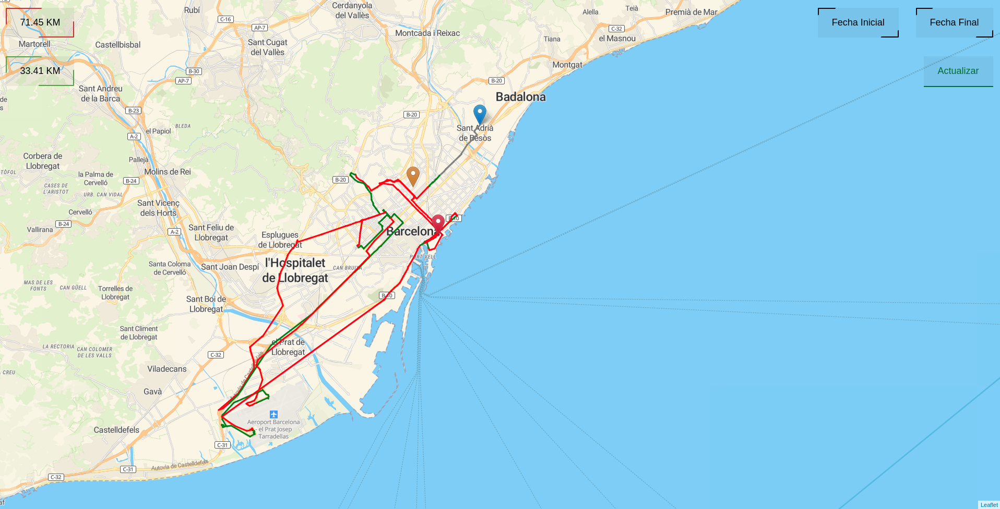

Application built on HTML, JavaScript, CSS, SQL and PHP, to preview the live location of a GPS. This is a personal project, so anything here has not been build to use on external projects.

## Run the Application

```shell
git clone https://github.com/Sklyvan/LiveGPS
cd LiveGPS
```

Then, you just have to run the Main.html file.

```shell
http://localhost:63342/LiveGPS/index.html
```

